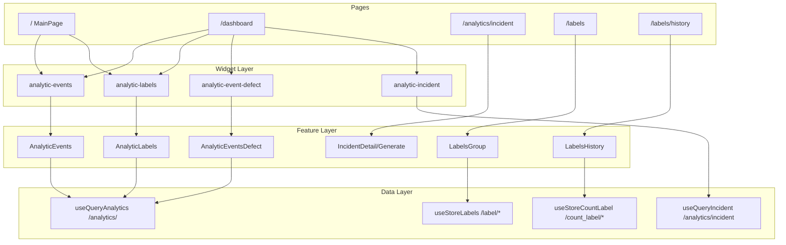

# Обзор проекта: аналитика и этикетки — 23.06.2025

> Дополнение к [аудиту от 22.06.2025](./analytics-audit-2025-06-22.md).  
> **Ограничения:** цвета зафиксированы (предложения по цвету не включены); неиспользуемые виджеты не предлагать к удалению — проект на стадии модификаций.

---

## Контекст

Проект предоставляет доступ к аналитике этикеток со состояниями:

| Код | Состояние |
|-----|-----------|
| `v` | верифицировано |
| `i` | инцидент |
| `d` | дефект |
| `p` | печать |

Дополнительно: группировка этикеток, история операций, журнал инцидентов, дашборды.

**Стек:** FSD (`entites` → `features` → `widgets` → `pages`), TanStack Query (аналитика), Zustand (этикетки, дашборды), Recharts, Mantine.

---

## Архитектура (что уже хорошо)

- **Разделение слоёв** — виджеты оборачивают feature-компоненты, страницы собирают layout. Цепочка: `pages` → `widgets` → `features` → `entites`.
- **Кэширование аналитики** — `staleTime: 120s`, `gcTime: 300s` в `constants.ts`; одинаковые запросы дедуплицируются React Query (6 виджетов `itog-set` с одними `filterdate` + `event` не должны бить API 6 раз).
- **Lazy-load дашборда** — `loadAnalyticsWidgets()` на `/dashboard` откладывает загрузку recharts.
- **Drill-down на главной** — клик по графику уменьшает шаг (`y → mon → w → d → h → m → s`) с кнопкой «Назад».
- **Связка инцидентов** — pie на `/dashboard` ведёт в журнал с предзаполненным фильтром (`buildIncidentReportUrl`).

### Карта модулей



---

## Критичные баги и технический долг

### B1. Ошибка классификации дефектов

**Файл:** `src/features/analytics/widgets/events-defect.tsx` (строки 77–82)

«Некорректный код агрегата» попадает в категорию «Код был недавно отканирован» — pie-диаграмма дефектов искажает статистику.

```ts
if (
  code.includes("Некорректный код агрегата! Код") &&
  code.includes("от другого уровня")
) {
  return "Дубликат кода: Код был недавно отканирован"; // ← неверная категория
}
```

**Fix:** отдельная категория или корректный alias.

---

### B2. Баг в навигации «Назад» на главной

**Файл:** `src/pages/main-page.tsx` (строки 88–95)

`history.pop()` мутирует массив до `setHistory`.

```ts
const newQuery = history.pop();
setHistory([...history]);
```

**Fix:** `setHistory(prev => prev.slice(0, -1))` и взять последний элемент из копии.

---

### B3. Некорректный `useEffect` для синхронизации даты

**Файл:** `src/pages/main-page.tsx` (строки 103–108)

Зависимость — значение массива, а не подписка на store. При смене даты из другого места эффект может не сработать.

**Fix:** Zustand selector или явная подписка на `$filterdate`.

---

### B4. Пагинация истории этикеток

**Файл:** `src/entites/labels/stores/use-store-count-label.ts` (строки 59–60)

```ts
} while (history.length % params.size === 0 && res.data.response.length);
```

При ровном числе записей (100, 200, …) возможен лишний запрос. Условие лучше строить от `res.data.response.length === params.size`.

---

### B5. Мёртвый код на странице группировки

**Файл:** `src/pages/labels/lables-page.tsx` (строки 11–87)

Функция `grouped()` дублирует `useGrouped` из `entites/labels/stores/hooks/use-grouped.tsx` и нигде не вызывается.

**Fix:** удалить мёртвый код (не виджеты).

---

### B6. Карта alias дефектов

**Файл:** `src/features/analytics/widgets/events-defect.tsx` (строки 19–57)

- 35+ строк inline в компоненте
- Дубликаты ключей (`"Некорректная пара кодов"`)
- Опечатки (`"влоежния"` / `"влоежния"`, `"Некорретная"`)

**Fix:** вынести в `entites/analytics/constants/defect-aliases.ts` + unit-тесты.

---

## Оптимизация производительности

### Запросы к API

| Место | Проблема | Рекомендация |
|-------|----------|--------------|
| Главная `/` | 6× `itog-set` + 2× `analytic-labels` + 2× `analytic-events` + балансы | React Query кэширует; имеет смысл **один контекст запроса** на странице и производные метрики (sum/min/max/avg) из одного ответа |
| `useFetchAnalyticsEvents` | Свой `useState` для data/loading поверх `fetchQuery` | Перейти на **`useQueries`** — фоновый refetch, единый loading |
| История этикеток | Загрузка **всех** страниц при открытии (`do…while`) | Серверная пагинация в UI: подгрузка по скроллу или фильтр по дате |
| `AnalyticLabels` | Тройной цикл `labels × production × data` | Индекс `Map<date, Map<label, count>>` вместо перебора всех комбинаций |

### Бандл

**Файл:** `vite.config.ts`

Сейчас вынесен только `recharts`. Добавить chunks для `@mantine/*`, `xlsx`, `@tanstack/react-table`.

### «Хуки» на уровне модуля

**Файлы:** `widgets/analytics/index.ts:11-12`, `features/analytics/widgets/events.tsx:33`, `app/widgets.tsx:8-9`

```ts
const es = useEnumsStep();
const ee = useEnumsEvents();
```

Сейчас это статические обёртки без React state — работает, но вводит в заблуждение.

**Fix:** экспортировать `eventsDataSelect` / `stepDataSelect` из `constants.ts` без префикса `use`.

---

## Дублирование кода

| # | Что дублируется | Файлы | Рекомендация |
|---|-----------------|-------|--------------|
| D1 | `formatName` + чекбокс «Группировать по Gap» | `features/analytics/widgets/labels.tsx`, `type.tsx` | `useLabelFormatName(filterGap)` + `LabelGapToggle` |
| D2 | `grouped()` | `pages/labels/lables-page.tsx`, `use-grouped.tsx` | Удалить мёртвую копию |
| D3 | Загрузка истории | `useStoreCountLabel.loadHistory`, `useQueryHistory` | Один источник |
| D4 | Widget/feature double fetch | см. аудит 22.06, этап 8 | Hook только в feature |

---

## UX и дизайн

> Предложения по цветам не включены — палитра зафиксирована в `constants.ts`.

### Главная аналитика (`/`)

| # | Проблема | Рекомендация |
|---|----------|--------------|
| UX1 | Drill-down без контекста | Breadcrumb: «2025 → Июнь → Неделя 24 → 15.06» |
| UX2 | Два виджета `analytic-labels` (default + stack) | Переключатель типа в одном виджете (как `allowChangeType` на `/dashboard`) |
| UX3 | 6 карточек `itog-set` в правой колонке | Одна карточка «Сводка» с метриками в grid |
| UX4 | На stack/table только `v` и `d` | Проверить с продуктом: нужны ли `p` и `i` на главной |

### Дашборд (`/dashboard`)

- Хороший набор: events, labels, defects, pie, type, incidents.
- Pie и type с `step="mon"` — явно показывать шаг в subtitle (`QueryShow` частично есть).

### Группировка этикеток (`/labels`)

| # | Проблема | Рекомендация |
|---|----------|--------------|
| UX5 | Только одно производство | Обзор по всем линиям (read-only) |
| UX6 | Опечатка «хотитее удалить» | `lables-group.tsx:65` |
| UX7 | Нет связи с аналитикой | Переход из графика расхода к группе/истории формата |

### История операций (`/labels/history`)

| # | Проблема | Рекомендация |
|---|----------|--------------|
| UX8 | Нет фильтра по дате | Добавить `filterdate` |
| UX9 | Полная загрузка истории | Пагинация / виртуализация |
| UX10 | Дублирование layout | Упростить карточный + табличный рендер |

### Журнал инцидентов (`/analytics/incident`)

| # | Проблема | Рекомендация |
|---|----------|--------------|
| UX11 | Вкладки размонтируют панели | `keepMounted` или скрытие через CSS |
| UX12 | Deep-link из дашборда | ✅ уже работает (`?data=…&tab=generate`) |
| UX13 | Loading на кнопках периода | См. аудит 22.06, H5 |

---

## Виджеты: регистрация и использование

> Неиспользуемые виджеты **не удалять** — WIP.

| `type` | Главная `/` | Dashboard `/dashboard` | Примечание |
|--------|-------------|------------------------|------------|
| `analytic-events` | ✅ | ✅ | |
| `analytic-labels` | ✅ ×2 | ✅ | Дубли на главной |
| `analytic-itog-set` | ✅ ×6 | ❌ | |
| `labels-current-balance` | ✅ ×2 | ❌ | |
| `analytic-pie` | ❌ | ✅ | |
| `analytic-type` | ❌ | ✅ | |
| `analytic-event-defect` | ❌ | ✅ | |
| `analytic-incident` | ❌ | ✅ | |
| `analytics-count` | ❌ | закомментирован | stub |
| `count` | ❌ | закомментирован | stub (`return ""`) |

**Orphan whitelist:** `"analytic-incident-widget"`, `"count-widget"` в `use-store-dashboard-second.tsx` — не зарегистрированы в `FactoryWidget`.

---

## Приоритеты

### Высокий

1. Исправить `calckDefect` для «Некорректный код агрегата» (B1)
2. Исправить `back()` и deps в `useEffect` на главной (B2, B3)
3. Починить условие пагинации в `loadHistory` (B4)
4. Вынести alias дефектов в constants + тесты (B6)
5. Этап 8 из аудита 22.06 — double/triple fetch

### Средний

6. `useQueries` вместо `useFetchAnalyticsEvents`
7. Общий хук `useLabelFormatName` + `LabelGapToggle` (D1)
8. Пагинация / фильтр по дате в истории этикеток (UX8, UX9)
9. Breadcrumb для drill-down на главной (UX1)
10. `keepMounted` для вкладок инцидентов (UX11)
11. Skeleton для labels, type, events-defect (аудит H8)

### Низкий

12. Переименовать `useEnumsEvents` → константы без `use` (B6-style naming)
13. Дополнительные `manualChunks` в Vite
14. Убрать мёртвый `grouped()` из `lables-page.tsx` (B5)
15. Унификация имён: `lables` → `labels`, `entites` → `entities` (постепенно)
16. Unit-тесты: `analytics-query.ts`, `incident-query.ts`, `formatTimestampByStep`

---

## Итог

База заложена правильно: FSD, React Query, виджетная система, связка дашборд → инциденты. Главные риски:

1. **Искажённая статистика дефектов** (B1)
2. **Полная загрузка истории этикеток** (B4, UX9)
3. **Мелкие баги навигации** на главной (B2, B3)

Наибольший UX-выигрыш: breadcrumb при drill-down, фильтр даты в истории, объединение дублирующихся виджетов этикеток на главной.

---

## Связанные документы

- [Аудит и план этапов 7–11](./analytics-audit-2025-06-22.md)
